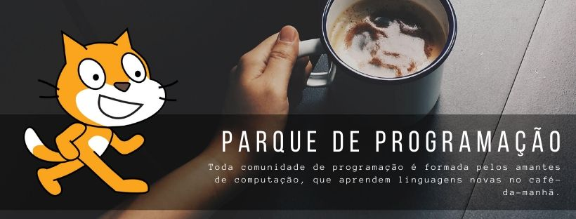

###### 

> Aprenda lógica de programação neste curso passo a passo.

Você aprenderá a programar criando jogos divertidos onde os jogadores destroem asteróides,
jogam basquete e fogem de labirintos!
Cada jogo inclui instruções fáceis de seguir, perguntas de revisão e desafios 
criativos de codificação para tornar o jogo seu. Deseja adicionar mais níveis ou um código de
trapaça? Não tem problema, basta escrever um código.

O Scratch é uma ferramenta interessante para aqueles que desejam aprender a programar.
No Brasil, é utilizado tanto na Educação Básica como nas universidades. 
Scratch é uma linguagem de programação criada em 2007 pelo Media Lab do MIT.
Desde 2013 o Scratch 2 está disponível on-line e como uma aplicação para Windows,
OS X, e Linux.

[Scratch Programming Playground <3!](https://inventwithscratch.com/)

#### CONTEÚDO

##### 1 - INICIANDO COM O SCRATCH

- Executando o Scratch
- Rodando o Editor Scratch Nativamente
- Conhecendo o Stripes do Editor Scratch
- Conhecendo o Paint do Editor Scratch
- Conhecendo Blocos de Código
    - Adicionando Blocos
    - Deletando Blocos
    - Rodando Programas
- Exibindo seus programas
    - Conseguindo Ajuda
    - O botão Ver dentro

#### 2 - DESENHANDO ARCO-ÍRIS NO ESPAÇO!

- Pensando o Projeto
- Criando o Pano de Fundo do Espaço
- Limpar e preparar o estado inicial
- Criando 3 pontos de ping pong
    - Pintando os pontos
    - Adicionar código para o ponto 1
    - Duplicando o ponto 1
 - Desenhe as Linhas do Arco-Íris
    - Adicione o código para o ponto
- Programa Completo
- Modo Turbo
- Versão 2.0: Triangulos no Arco-Íris
- Versão 3.0: Duas Linhas de Arco-Íris
- Versão 4.0: Você Decide

#### 3 - FUGINDO DO LABIRINTO

- Pensando o Projeto
- Faça o Gato andar ao redor
    - Adicionar código de movimento ao jogador
    - Duplicar o código de movimento para gato
- Faça os Níveis do Labirinto
    - Faça o download das imagens do labirinto
    - Alterar o pano de fundo
    - Comece no Primeiro Labirinto
- Mantenha o Gato dentro do Labirinto
    - Verifique se o gato está tocando nas paredes
- Crio o Premio da fuga
    - Crie o premio - Maça
    - Detectar quando o jogador chega na maça
    - Adicione o código de manipulação de transmissão do Labirinto
- Programa Completo
- Versão 2.0: Mode para 2 jogadores
    - Duplicando da maça
    - Modificando o código da segunda maça
    - Duplicando o gato laranja
    - Modificando o código do gato azul
    - Voltando à posição inicial
- VERSION 3.0: Armadilhas
    - Desenhe novas armadilhas
    - Crie um segundo traje para as armadilhas
    - Adicionar código de clonagem para as armadilhas
    - Modificando o código do Gato laranja
    - Copie o código do Gato Laranja para o Gato azul
- Modo Trapaça: Caminhe pelas paredes
    - Adicione o código de passagem através de paredes ao gato laranja
    - Adicione o código de passagem através de paredes ao gato azul

#### 4 - JOGANDO BASQUETE COM GRAVIDADE

- Pensando o Projeto
- Faça o Gato Saltar e Cair
    - Adicione código de gravidade ao gato
    - Adicione o código do nível do solo
- Faça o gato se mover para a esquerda e direita
    - Adicione o código de caminhada ao gato
- Faça o Aro de Basquete
    - Crie o aro
    - Crie a tabela
- Faça o gato arremessar a bola
    - Crie a Bola de Basquete
    - Adicione o código da Bola de Basquete
    - Detectar quando uma cesta é feita
    - Corrigir o erro na pontuação
- Programa Completo
    - Versão 2.0: Modo para 2 jogadores
    - Duplique o gato e a bola de basquete
    - Modifique o código do segundo gato
    - Modifique o código da segunda bola de basquete
- Modo Trapaça: Congelando o aro

#### 5 - UM APRIMORADO JOGO DE QUEBRAR TIJOLOS

